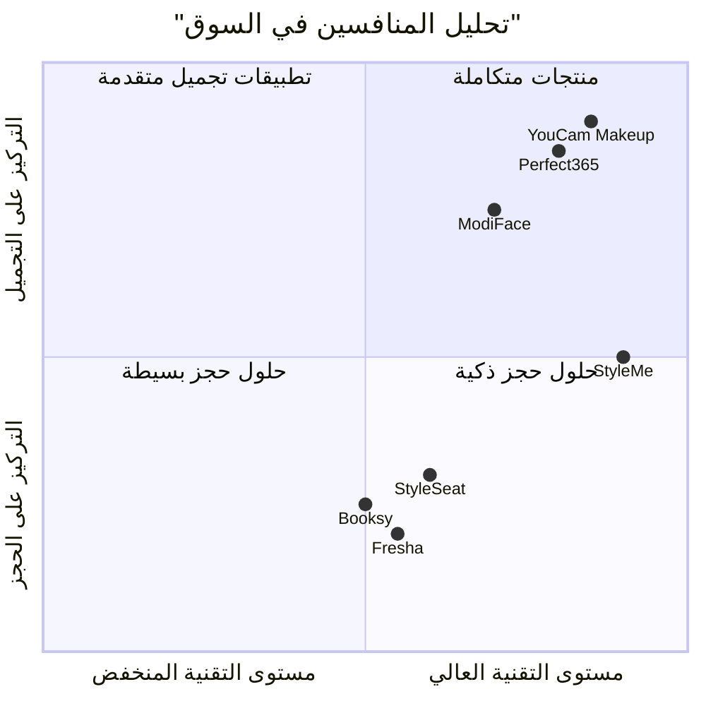

# مستند متطلبات المنتج (PRD) - تطبيق StyleMe

## معلومات المشروع الأساسية

**اللغة:** العربية والإنجليزية (ثنائي اللغة)  
**لغة البرمجة:** Shadcn-ui, TypeScript, Tailwind CSS  
**اسم المشروع:** styleme_app  
**الشعار:** تم توفيره في `/workspace/uploads/inbound1181259968803868950.jpg`

### إعادة صياغة المتطلبات الأصلية

تطبيق StyleMe هو منصة ذكية مدعومة بالذكاء الاصطناعي تهدف إلى تثوير تجربة اختيار قصات الشعر وحجز المواعيد في الصالونات. يسمح التطبيق للمستخدمين برفع صورهم الشخصية والحصول على اقتراحات قصات شعر مخصصة باستخدام الذكاء الاصطناعي، مع إمكانية حجز المواعيد مباشرة مع الصالونات والحلاقين المسجلين في المنصة.

## 1. تعريف المنتج

### 1.1 أهداف المنتج

1. **تحسين تجربة العميل:** توفير تجربة تفاعلية وآمنة لاختيار قصات الشعر قبل التنفيذ الفعلي
2. **ربط العملاء بالصالونات:** إنشاء منصة موحدة تجمع بين العملاء والصالونات المحلية بكفاءة عالية
3. **تعزيز الكفاءة التشغيلية:** تبسيط عملية حجز المواعيد وإدارة الصالونات من خلال حلول رقمية متطورة

### 1.2 قصص المستخدمين

1. **كعميل،** أريد رفع صورتي ومشاهدة قصات شعر مختلفة باستخدام الذكاء الاصطناعي **حتى** أتمكن من اختيار القصة المناسبة لي قبل الذهاب للصالون
2. **كعميل،** أريد إضافة ملاحظات وطلب تعديلات على القصة المختارة **حتى** أحصل على النتيجة المطلوبة بدقة
3. **كعميل،** أريد البحث عن الصالونات القريبة مني ومقارنة تقييماتها **حتى** أختار أفضل صالون يناسب احتياجاتي
4. **كصاحب صالون،** أريد استلام تفاصيل الحجوزات مع الصور والمواصفات **حتى** أستطيع تحضير الخدمة بشكل مثالي
5. **كحلاق،** أريد مشاهدة القصة المطلوبة مع التعليمات التفصيلية **حتى** أنفذها بأفضل شكل ممكن

### 1.3 التحليل التنافسي

| المنافس | نقاط القوة | نقاط الضعف | التقييم |
|---------|------------|-------------|---------|
| YouCam Makeup | 45+ قصة شعر، 150+ لون، تقنية AI متطورة | تركيز أكبر على المكياج، رسوم شهرية $10.99 | 8/10 |
| Perfect365 | جودة عالية، 100M+ مستخدم، تحديثات أسبوعية | خيارات قصات محدودة، لا يدعم حجز المواعيد | 7/10 |
| ModiFace | تخصص في الشعر، خيارات ألوان متنوعة | محدود في الأندرويد، لا يوجد ربط مع الصالونات | 6/10 |
| StyleSeat | حجز مواعيد متطور، إدارة صالونات | لا يوجد AI للقصات، رسوم حجز $2.35 | 7/10 |
| Booksy | سعر تنافسي $29.99، دعم ممتاز | لا يوجد تجربة افتراضية للقصات | 6/10 |
| Fresha | مجاني للمستقلين، سوق كبير | عمولة 20% على العملاء الجدد | 7/10 |
| StyleMe | AI متطور + حجز متكامل + لوحة إدارة شاملة | منتج جديد، يحتاج بناء قاعدة مستخدمين | 9/10 |

### 1.4 مخطط المنافسة الرباعي

## 2. المواصفات التقنية

### 2.1 تحليل المتطلبات

#### متطلبات المستخدم النهائي:
- **رفع الصور:** دعم التصوير المباشر ورفع من المعرض
- **الذكاء الاصطناعي:** توليد 6 خيارات متنوعة لقصات الشعر
- **التخصيص حسب الجنس:** 
  - للذكور: قصات الشعر + رسمة الذقن + لون الشعر
  - للإناث: قصات الشعر + لون الشعر
- **التفاعل:** إضافة ملاحظات وطلب تعديلات
- **البحث والاكتشاف:** العثور على الصالونات حسب الموقع والتقييمات
- **الحجز:** اختيار الحلاق والموعد المناسب

#### متطلبات الصالونات:
- **لوحة الإدارة:** dashboard شامل لإدارة الصالون
- **إدارة الحجوزات:** استلام تفاصيل الحجز مع الصور والمواصفات
- **إدارة الحلاقين:** إضافة وإدارة بيانات الحلاقين والمواعيد
- **التواصل:** نظام تواصل مع العملاء

#### متطلبات النظام العامة:
- **لوحة الإدارة العامة:** إدارة المنصة والمستخدمين والصالونات
- **الدعم الفني:** نظام تذاكر ودعم للمستخدمين
- **التقارير والتحليلات:** إحصائيات شاملة عن الاستخدام والأداء

### 2.2 مجموعة المتطلبات

#### المتطلبات الأساسية (P0)
- **REQ-001:** نظام تسجيل ودخول المستخدمين (OAuth, Email/Phone)
- **REQ-002:** رفع وتحليل الصور باستخدام AI
- **REQ-003:** توليد 6 اقتراحات قصات شعر مخصصة
- **REQ-004:** نظام التعديل والملاحظات على القصات
- **REQ-005:** قاعدة بيانات الصالونات مع البحث الجغرافي
- **REQ-006:** نظام حجز المواعيد المتكامل
- **REQ-007:** لوحة إدارة الصالونات
- **REQ-008:** نظام الدفع والفوترة

#### المتطلبات المهمة (P1)
- **REQ-009:** نظام التقييمات والمراجعات
- **REQ-010:** الإشعارات Push/SMS/Email
- **REQ-011:** لوحة الإدارة العامة للمنصة
- **REQ-012:** نظام الدعم الفني المتكامل
- **REQ-013:** التحليلات والتقارير المتقدمة
- **REQ-014:** نظام الولاء والعروض الترويجية
- **REQ-015:** دعم اللغات المتعددة (العربية/الإنجليزية) - **مطلوب أساسي**

#### المتطلبات المرغوبة (P2)
- **REQ-016:** التكامل مع وسائل التواصل الاجتماعي
- **REQ-017:** نظام الإحالة والمكافآت
- **REQ-018:** الذكاء الاصطناعي للتوصيات المخصصة
- **REQ-019:** واجهة برمجية API للتكامل مع أطراف ثالثة

### 2.3 مسودة تصميم واجهة المستخدم

#### 2.3.1 التطبيق الرئيسي (عملاء)

**الشاشة الرئيسية:**
- شعار StyleMe في الأعلى مع مفتاح تغيير اللغة (العربية/الإنجليزية)
- أزرار سريعة: "جرب قصة جديدة" / "Try New Style" - "ابحث عن صالون" / "Find Salon"
- عرض آخر النتائج المحفوظة مع دعم النصوص ثنائية اللغة
- قسم الصالونات المقترحة حسب الموقع مع أسماء باللغتين

**شاشة تجربة القصات:**
- كاميرا/رفع صورة مع معاينة فورية
- اختيار الجنس (ذكر/أنثى)
- عرض 6 خيارات في شبكة 2x3
- أدوات التعديل: سطوع، تباين، قص الصورة
- نظام التقييم بالنجوم لكل خيار

**شاشة تفاصيل القصة:**
- عرض القصة بملء الشاشة
- أدوات التعديل المتقدمة
- مربع النص للملاحظات
- أزرار: "احفظ" - "شارك" - "احجز موعد"

**شاشة البحث عن الصالونات:**
- خريطة تفاعلية مع علامات الصالونات
- فلترة حسب: المسافة، التقييم، السعر، الخدمات
- قائمة عرض مع الصور والتقييمات
- شريط البحث للأسماء المحددة

#### 2.3.2 لوحة إدارة الصالونات

**الداشبورد الرئيسي:**
- إحصائيات اليوم: الحجوزات، الإيرادات، التقييمات
- تقويم بالمواعيد القادمة
- قائمة الحجوزات الجديدة مع التنبيهات
- إحصائيات الأداء الشهرية

**إدارة الحجوزات:**
- جدول شامل بكافة الحجوزات
- تفاصيل كل حجز: صورة العميل، القصة المطلوبة، الملاحظات
- حالة الحجز: معلق، مؤكد، مكتمل، ملغي
- أدوات التواصل مع العميل

**إدارة الحلاقين:**
- قائمة الحلاقين مع مهاراتهم وتخصصاتهم
- جداول العمل والإجازات
- إحصائيات أداء كل حلاق
- نظام المكافآت والعمولات

#### 2.3.3 لوحة الإدارة العامة

**إدارة المنصة:**
- إحصائيات شاملة للمستخدمين والصالونات
- إدارة الشكاوى والدعم الفني
- إدارة المحتوى والإعلانات
- تقارير مالية ومحاسبية

### 2.4 متطلبات التطبيق ثنائي اللغة

#### 2.4.1 المتطلبات التقنية للترجمة
- **نظام i18n (Internationalization):** تطبيق مكتبات Next.js i18n للتبديل بين العربية والإنجليزية
- **RTL/LTR Support:** دعم الكتابة من اليمين لليسار للعربية ومن اليسار لليمين للإنجليزية
- **قاعدة البيانات:** تخزين المحتوى باللغتين في جداول منفصلة أو حقول متعددة
- **الخطوط:** دعم خطوط عربية وإنجليزية مناسبة للواجهات الحديثة

#### 2.4.2 تجربة المستخدم ثنائية اللغة
- **التبديل السريع:** زر تغيير اللغة في الزاوية العلوية اليمنى
- **الحفظ التلقائي:** تذكر اختيار اللغة المفضلة للمستخدم
- **المحتوى المختلط:** عرض أسماء الصالونات والحلاقين باللغة المحلية مع ترجمة الواجهة
- **الإشعارات:** إرسال الإشعارات بلغة المستخدم المفضلة

#### 2.4.3 المحتوى متعدد اللغات
- **أوصاف القصات:** ترجمة أسماء وأوصاف قصات الشعر
- **تعليمات الحلاقين:** شرح طرق التنفيذ باللغتين
- **نصوص الواجهة:** ترجمة شاملة لكافة عناصر الواجهة
- **رسائل الخطأ:** ترجمة رسائل النظام والتحذيرات

### 2.5 الأسئلة المفتوحة

1. **تقنية الذكاء الاصطناعي:** هل سنستخدم APIs جاهزة مثل OpenAI Vision أم سنطور نماذج مخصصة؟
2. **معالجة الدفع:** ما هي بوابات الدفع المفضلة في المنطقة المستهدفة؟
3. **الخصوصية:** كيف سيتم التعامل مع صور المستخدمين وضمان الخصوصية؟
4. **التوسع الجغرافي:** هل التطبيق مخصص لمنطقة محددة أم للانتشار الإقليمي؟
5. **نموذج الإيرادات:** هل ستكون العمولة على الحجوزات أم اشتراكات شهرية للصالونات؟
6. **التكامل:** هل نحتاج تكامل مع أنظمة إدارة الصالونات الموجودة؟
7. **استراتيجية المحتوى:** كيف سيتم إدارة وتحديث المحتوى باللغتين؟

## 3. التحليل السوقي والاستراتيجي

### 3.1 حجم السوق والفرص

**السوق العالمي:**
- قيمة سوق تطبيقات تجربة الشعر الافتراضية: 1.12 مليار دولار (2024)
- معدل النمو المتوقع: 19.4% - 21.7% سنوياً
- القيمة المتوقعة بحلول 2033: 5.45 - 8.38 مليار دولار

**السوق الإقليمي (الشرق الأوسط وأفريقيا):**
- قيمة سوق العناية بالشعر: 5.46 مليار دولار (2025)
- النمو المتوقع: 4.35% سنوياً حتى 2030
- قيمة سوق الجمال الشخصي: 46 مليار دولار حالياً، 60 مليار بحلول 2025

### 3.2 الاتجاهات الرئيسية

- **التحول الرقمي:** نمو التجارة الإلكترونية بمعدل 12.05% في المنطقة
- **الجيل الشاب:** 55% من سكان المنطقة تحت سن 30 عاماً
- **اعتماد الهواتف الذكية:** 97% في المملكة العربية السعودية
- **المنتجات الطبيعية:** 58.7% من المستهلكين يفضلون المنتجات الخالية من المواد الكيميائية

### 3.3 النموذج التجاري المقترح

**مصادر الإيرادات:**
1. **عمولة الحجوزات:** 8-12% من قيمة كل حجز
2. **اشتراكات الصالونات:** باقات شهرية متدرجة (50-200 دولار)
3. **الإعلانات المدفوعة:** عرض الصالونات في مقدمة النتائج
4. **الخدمات المتميزة:** ميزات إضافية مثل التحليل المتقدم

**هيكل التكاليف:**
- تطوير وصيانة الذكاء الاصطناعي: 40%
- التسويق وكسب العملاء: 30%
- العمليات والدعم: 20%
- البنية التحتية التقنية: 10%

## 4. خطة التنفيذ والمراحل

### المرحلة الأولى (3-4 أشهر): MVP ثنائي اللغة
- تطوير نظام رفع الصور وتجربة القصات الأساسية
- **تطبيق الدعم ثنائي اللغة (العربية/الإنجليزية) من البداية**
- إنشاء قاعدة بيانات الصالونات الأساسية مع المحتوى ثنائي اللغة
- تطوير نظام الحجز البسيط مع واجهات باللغتين
- لوحة إدارة الصالونات الأساسية مع دعم اللغتين

### المرحلة الثانية (2-3 أشهر): التحسين والتوسع
- تطوير خوارزميات الذكاء الاصطناعي المتقدمة
- إضافة نظام التقييمات والمراجعات باللغتين
- تطوير لوحة الإدارة العامة الشاملة مع دعم متعدد اللغات
- نظام الدعم الفني المتكامل (عربي/إنجليزي)
- **تحسين نظام الترجمة وتجربة RTL/LTR**

### المرحلة الثالثة (2 شهر): التحسين والإضافات
- التكامل مع وسائل التواصل الاجتماعي
- نظام التحليلات المتقدم مع تقارير ثنائية اللغة
- ميزات الولاء والمكافآت
- **تحسين المحتوى المحلي والترجمة الآلية للمحتوى الديناميكي**

## 5. معايير النجاح والمقاييس

### مؤشرات الأداء الرئيسية (KPIs):

**للمستخدمين:**
- عدد التحميلات الشهرية: الهدف 10,000 في الشهر الأول
- معدل الاحتفاظ: 60% بعد 30 يوم
- متوسط الجلسات لكل مستخدم: 3-4 جلسات شهرياً
- معدل التحويل من تجربة إلى حجز: 25%

**للصالونات:**
- عدد الصالونات المسجلة: 100 صالون في الأشهر الستة الأولى
- متوسط الحجوزات لكل صالون شهرياً: 50 حجز
- رضا الصالونات: تقييم 4.5/5 أو أعلى
- معدل الاحتفاظ بالصالونات: 85% سنوياً

**المالية:**
- الإيرادات الشهرية: 50,000 دولار بنهاية السنة الأولى
- هامش الربح الإجمالي: 70%
- متوسط قيمة الحجز: 25-40 دولار
- كلفة اكتساب العميل: أقل من 15 دولار

هذا المستند يشكل الأساس الشامل لتطوير تطبيق StyleMe بجميع مكوناته التقنية والتجارية والاستراتيجية.