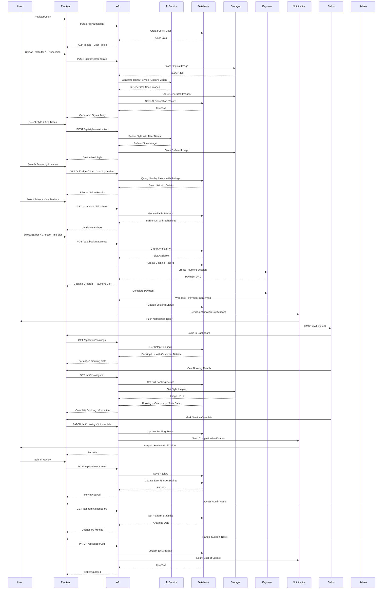

# تصميم النظام المعماري - تطبيق StyleMe

## نظرة عامة على المشروع

**اسم المشروع:** StyleMe - منصة ذكية لتجربة قصات الشعر وحجز المواعيد
**النوع:** تطبيق ويب ثنائي اللغة (العربية/الإنجليزية) 
**التقنيات الأساسية:** Next.js, TypeScript, Tailwind CSS, Shadcn-ui

## Implementation approach

سنقوم ببناء تطبيق ويب متكامل يجمع بين الذكاء الاصطناعي وإدارة الحجوزات مع دعم كامل للغتين العربية والإنجليزية. النقاط الصعبة في المتطلبات تشمل:

1. **تكامل الذكاء الاصطناعي لمعالجة الصور:** سنستخدم OpenAI Vision API أو Replicate API لتوليد قصات الشعر المخصصة
2. **النظام ثنائي اللغة:** تطبيق Next.js i18n مع دعم RTL/LTR الكامل
3. **نظام الموقع الجغرافي:** استخدام Google Maps API مع فلترة متقدمة للصالونات
4. **إدارة المواعيد المعقدة:** نظام تقويم متطور مع إشعارات في الوقت الفعلي

**الإطار التقني المختار:**
- **Frontend:** Next.js 14 مع App Router, TypeScript, Tailwind CSS, Shadcn-ui
- **Backend:** Next.js API Routes مع Prisma ORM
- **قاعدة البيانات:** PostgreSQL مع Supabase
- **الذكاء الاصطناعي:** OpenAI Vision API / Replicate API
- **الخرائط:** Google Maps API
- **التخزين:** Supabase Storage للصور
- **المصادقة:** NextAuth.js مع دعم OAuth
- **الإشعارات:** Pusher للتحديثات الفورية
- **الدفع:** Stripe API

## Data structures and interfaces

```mermaid
classDiagram
    class User {
        +String id
        +String email
        +String phone
        +String name
        +String avatar
        +Gender gender
        +String preferredLanguage
        +DateTime createdAt
        +DateTime updatedAt
        +createProfile(data: UserProfile) User
        +updateLanguage(lang: String) User
        +getBookings() Booking[]
    }

    class Salon {
        +String id
        +String name_ar
        +String name_en
        +String description_ar
        +String description_en
        +String address
        +Float latitude
        +Float longitude
        +String phone
        +String email
        +Float rating
        +Integer reviewCount
        +SalonStatus status
        +String ownerId
        +DateTime createdAt
        +DateTime updatedAt
        +addBarber(barber: Barber) Barbar
        +updateLocation(lat: Float, lng: Float) Salon
        +getAvailableSlots(date: Date) TimeSlot[]
        +calculateRating() Float
    }

    class Barber {
        +String id
        +String name
        +String specialties[]
        +String salonId
        +Float rating
        +String bio_ar
        +String bio_en
        +BarberStatus status
        +DateTime createdAt
        +DateTime updatedAt
        +getAvailableSlots(date: Date) TimeSlot[]
        +updateSchedule(schedule: Schedule) Barber
        +getBookings(dateRange: DateRange) Booking[]
    }

    class Booking {
        +String id
        +String userId
        +String salonId
        +String barberId
        +DateTime appointmentTime
        +BookingStatus status
        +String originalImageUrl
        +String selectedStyleImageUrl
        +String customerNotes_ar
        +String customerNotes_en
        +String barberInstructions_ar
        +String barberInstructions_en
        +Float price
        +DateTime createdAt
        +DateTime updatedAt
        +confirmBooking() Booking
        +cancelBooking(reason: String) Booking
        +completeService() Booking
        +addNotes(notes: String, lang: String) Booking
    }

    class AIStyleGeneration {
        +String id
        +String userId
        +String originalImageUrl
        +String[] generatedStyles
        +Gender targetGender
        +String preferences
        +DateTime createdAt
        +generateStyles(image: File, gender: Gender) String[]
        +refineStyle(styleId: String, notes: String) String
        +saveUserPreference(userId: String, styleType: String) void
    }

    class Review {
        +String id
        +String userId
        +String salonId
        +String barberId
        +String bookingId
        +Integer rating
        +String comment_ar
        +String comment_en
        +DateTime createdAt
        +DateTime updatedAt
        +updateReview(rating: Integer, comment: String) Review
        +deleteReview() Boolean
    }

    class SupportTicket {
        +String id
        +String userId
        +String salonId
        +TicketType type
        +TicketPriority priority
        +TicketStatus status
        +String subject_ar
        +String subject_en
        +String description_ar
        +String description_en
        +String assignedAgentId
        +DateTime createdAt
        +DateTime updatedAt
        +assignAgent(agentId: String) SupportTicket
        +updateStatus(status: TicketStatus) SupportTicket
        +addMessage(message: String, sender: String) SupportMessage
    }

    class Admin {
        +String id
        +String email
        +String name
        +AdminRole role
        +String[] permissions
        +DateTime createdAt
        +DateTime updatedAt
        +manageSalons() Salon[]
        +generateReports(dateRange: DateRange) Report
        +handleSupport(ticketId: String) SupportTicket
    }

    class Payment {
        +String id
        +String bookingId
        +String userId
        +Float amount
        +String currency
        +PaymentStatus status
        +String stripeSessionId
        +DateTime createdAt
        +DateTime updatedAt
        +processPayment(amount: Float) PaymentResult
        +refundPayment(reason: String) PaymentResult
    }

    class Notification {
        +String id
        +String userId
        +NotificationType type
        +String title_ar
        +String title_en
        +String message_ar
        +String message_en
        +Boolean isRead
        +DateTime createdAt
        +markAsRead() Notification
        +sendPushNotification() Boolean
    }

    %% Relationships
    User ||--o{ Booking : creates
    User ||--o{ Review : writes
    User ||--o{ SupportTicket : submits
    User ||--o{ AIStyleGeneration : generates
    
    Salon ||--o{ Barber : employs
    Salon ||--o{ Booking : receives
    Salon ||--o{ Review : receives
    
    Barber ||--o{ Booking : serves
    Barber ||--o{ Review : receives
    
    Booking ||--|| Payment : requires
    Booking ||--o| Review : generates
    
    Admin ||--o{ SupportTicket : handles
    Admin ||--o{ Salon : manages
```

## Program call flow



## Anything UNCLEAR

1. **تقنية الذكاء الاصطناعي المحددة:** يحتاج تحديد ما إذا كنا سنستخدم OpenAI Vision API أم Replicate API أم تطوير نموذج مخصص للحصول على أفضل النتائج لقصات الشعر العربية والشرق أوسطية.

2. **استراتيجية التسعير:** لم يتم تحديد نموذج التسعير النهائي - هل ستكون عمولة على الحجوزات أم اشتراكات شهرية للصالونات أم نموذج مختلط؟

3. **التكامل مع أنظمة الصالونات الموجودة:** هل نحتاج APIs للتكامل مع أنظمة POS أو إدارة الصالونات الحالية؟

4. **سياسة الخصوصية للصور:** يحتاج تحديد واضح لسياسة حفظ وحذف صور المستخدمين وضمان الامتثال لقوانين حماية البيانات.

5. **النطاق الجغرافي:** هل التطبيق مخصص لدولة محددة أم للمنطقة بأكملها؟ هذا يؤثر على اختيار العملات وطرق الدفع والامتثال القانوني.

6. **مستوى التخصيص في الذكاء الاصطناعي:** هل نحتاج نماذج مدربة خصيصاً على أنواع الشعر والوجوه في المنطقة العربية لتحسين دقة النتائج؟

7. **استراتيجية المحتوى متعدد اللغات:** كيف سيتم إدارة ترجمة المحتوى الديناميكي مثل أسماء الصالونات والتقييمات بين العربية والإنجليزية؟